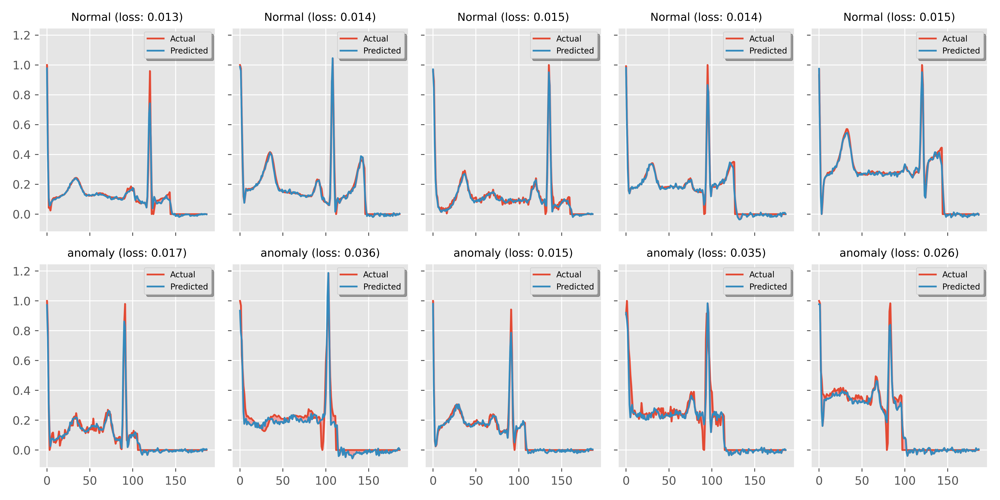

# ECG Anomaly Detection with CNN Autoencoders



## Introduction

This project demonstrates the use of Convolutional Neural Network (CNN) Autoencoders for anomaly detection in electrocardiogram (ECG) signals. The system is designed to identify abnormal ECG patterns that may indicate cardiac issues, providing a tool for preliminary screening and analysis of heart activity.

## Project Overview

The ECG Anomaly Detection system consists of three main components:

1. **CNN Autoencoder Model**: A deep learning model trained to reconstruct normal ECG signals
2. **FastAPI Backend**: An API service that provides endpoints for ECG analysis
3. **React Web Interface**: A user-friendly frontend for uploading and analyzing ECG signals

### How It Works

The system uses an unsupervised learning approach based on reconstruction error:

1. The autoencoder learns to efficiently compress and reconstruct normal ECG patterns
2. When an abnormal ECG is encountered, the reconstruction error is higher
3. By setting a threshold on this reconstruction error, we can classify signals as normal or anomalous

## Dataset

The project uses the PTB Diagnostic ECG Database:

- **Number of Samples**: 14,552 ECG recordings
- **Classes**: Normal and Abnormal heartbeats
- **Sampling Frequency**: 125Hz
- **Source**: Physionet's PTB Diagnostic Database

## Model Architecture

The CNN Autoencoder consists of:

### Encoder

- Input reshaping to 3D for Conv1D operations
- Multiple Conv1D layers with ReLU activation
- BatchNormalization for training stability
- MaxPooling1D for dimension reduction
- Final encoding into a 32-dimensional latent space

### Decoder

- Conv1DTranspose layers to reconstruct the signal
- BatchNormalization between layers
- Final dense layer to produce the reconstructed signal

## Performance

The model achieves impressive performance metrics:

- **Training Accuracy**: ~94%
- **Testing Accuracy**: ~92%
- **Anomaly Detection**: ~94%

## API Documentation

The FastAPI backend provides several endpoints:

- `GET /`: Root endpoint with API information
- `POST /api/predict`: Submit ECG data for prediction
- `POST /api/predict/image`: Submit ECG image for prediction
- `POST /api/predict/visualize`: Get visualization of prediction result
- `GET /api/samples/{sample_type}/{index}`: Get sample ECG data
- `GET /docs`: Interactive API documentation

### Example API Usage

```python
import requests
import json
import numpy as np

# Example: Predict using ECG data
url = "http://localhost:8000/api/predict"
data = {"data": [0.1, 0.2, ...]}  # 187 data points
response = requests.post(url, json=data)
result = response.json()
```

## Web Interface

The React web application provides an intuitive interface for:

- Uploading ECG images
- Visualizing original and reconstructed signals
- Displaying classification results
- Showing reconstruction error metrics

## Project Structure

```
├── anomaly-detection-with-cnn-autoencoders.ipynb  # Main notebook with model development
├── autoencoder.png                                # Model architecture visualization
├── ecg_anomaly_api.py                            # FastAPI backend implementation
├── ecg_anomaly_detector_model/                   # Saved TensorFlow model
│   ├── saved_model.pb
│   └── ...
├── ptbdb_normal.csv/                             # Normal ECG data
├── ptbdb_abnormal.csv/                           # Abnormal ECG data
├── static/                                       # Static files for the API
│   └── images/                                   # Generated visualizations
└── WebPageECG/                                   # React frontend application
```

## Installation and Setup

### Prerequisites

- Python 3.8+
- TensorFlow 2.x
- FastAPI
- Node.js 14+
- npm or yarn

### Backend Setup

1. Clone the repository
2. Install Python dependencies:
   ```
   pip install tensorflow fastapi uvicorn pandas numpy matplotlib scikit-learn scipy opencv-python
   ```
3. Start the API server:
   ```
   uvicorn ecg_anomaly_api:app --host 0.0.0.0 --port 8000
   ```

### Frontend Setup

1. Navigate to the WebPageECG directory:
   ```
   cd WebPageECG/WebPageECG
   ```
2. Install dependencies:
   ```
   npm install
   ```
3. Start the development server:
   ```
   npm run dev
   ```

## Usage

1. Start both the backend API and frontend servers
2. Open the web interface in your browser (typically at http://localhost:5173)
3. Upload an ECG image
4. Click "Analyze" to process the ECG
5. View the results showing classification and visualization

## Model Training

If you want to retrain the model or understand the development process:

1. Open `anomaly-detection-with-cnn-autoencoders.ipynb` in Jupyter Notebook or Google Colab
2. Follow the step-by-step process for data loading, preprocessing, model building, and evaluation
3. The notebook includes detailed explanations and visualizations

## Further Development

Potential areas for expansion:

- Improving model accuracy with more sophisticated architectures
- Incorporating different types of cardiac abnormalities
- Adding real-time ECG analysis capability
- Developing a mobile app for ECG monitoring

## License

[Include your license information here]

## Acknowledgments

- PTB Diagnostic ECG Database from Physionet
- TensorFlow and Keras for the deep learning framework
- FastAPI for the backend API development
- React for the frontend interface

## Contact
